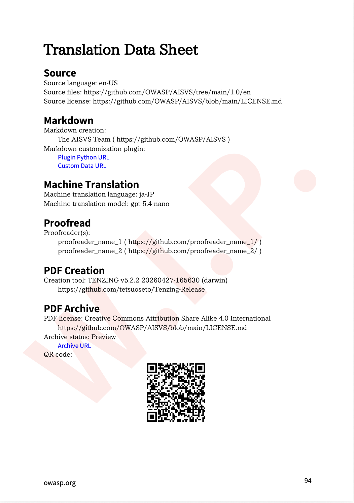

# Tenzing-Arxiv

The public repository serves two purposes:

1. Post PDF files built by Tenzing for preview with W.I.P. watermark or published without it.
2. (Optional) For published PDFs, translated Markdown files and custom JSON can be archived as well.

The directory structure of the repository is exactly like Build Repository; for example, ASVAll_en-US.pdf is stored on Tenzing-Arxiv/owasp/docgen/asv/en-US/baseline/ASVAll_en-US.pdf, where [organization code]/docgen/[project code]/[language code]/baseline/ASVAll_en-US.pdf. Markdown files are under [organization code]/docgen/[project code]/[language code], e.g., Tenzing-Arxiv/owasp/docgen/asv/en-US/ASV1001_0x01-Frontispiece.md

## Translation Data Sheet

It is recommended to attach one page description of the translation steps in English to the end of PDF as shown below. The template markdown file "ZZZ999999_TranslationDataSheet.md" can be found in "template" directory on this site.

